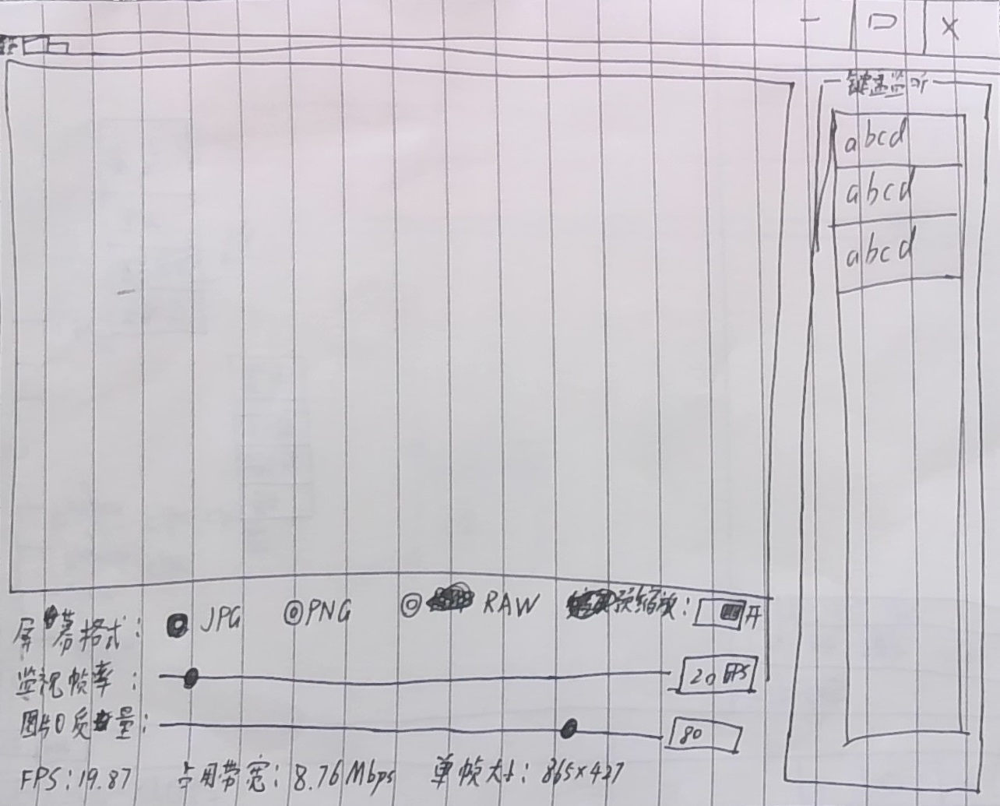
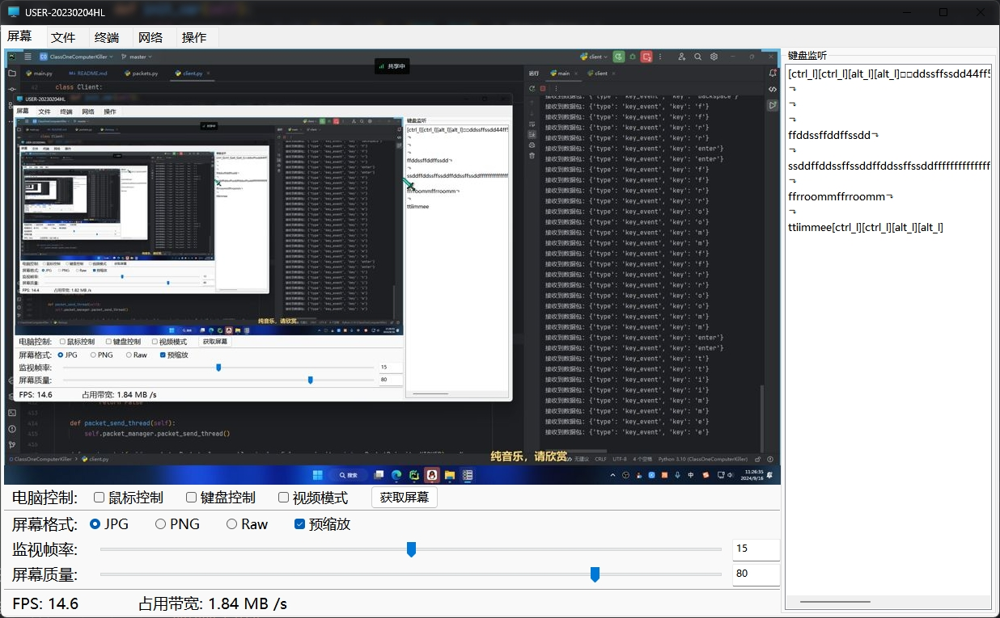
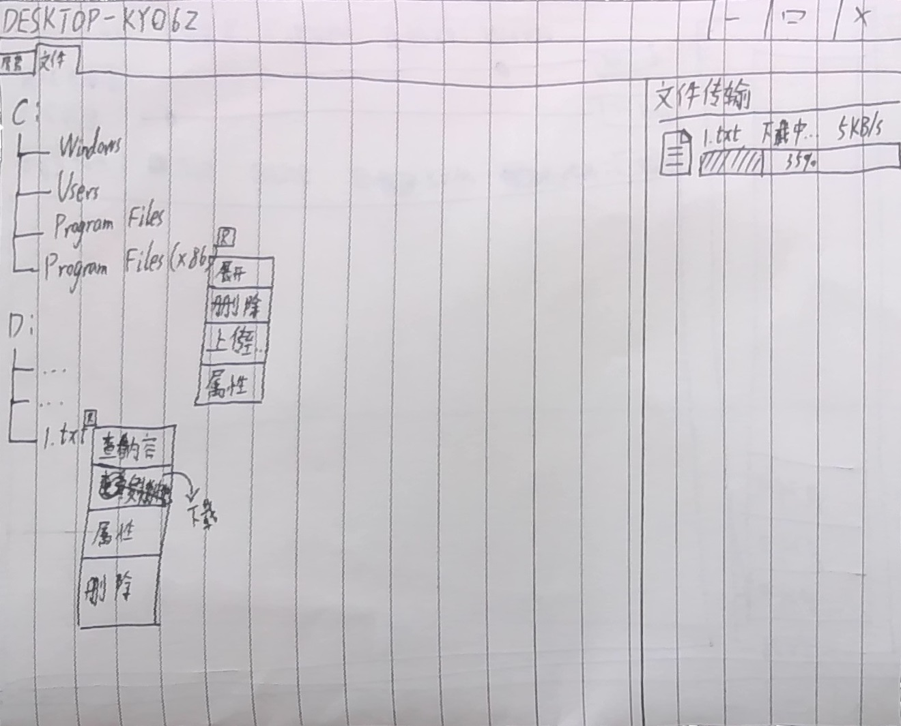
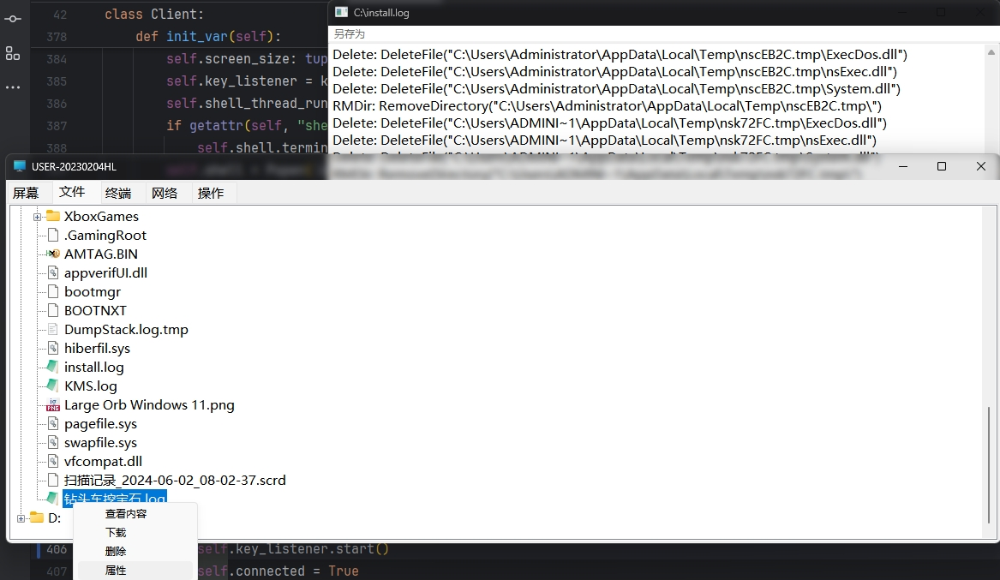
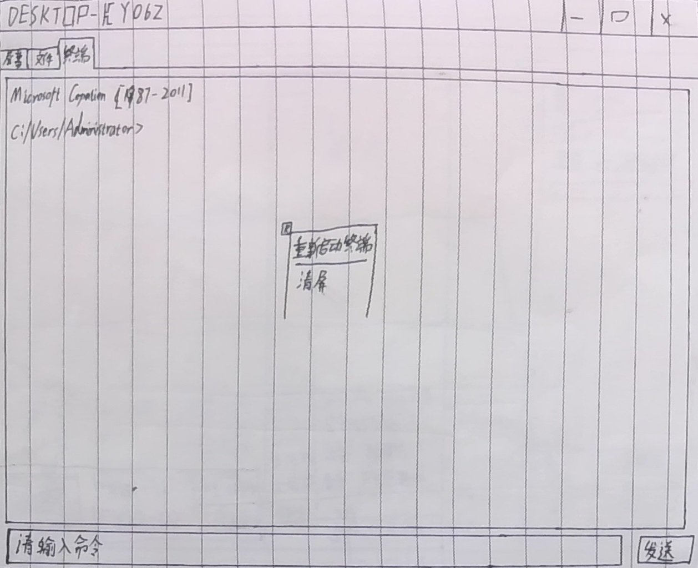
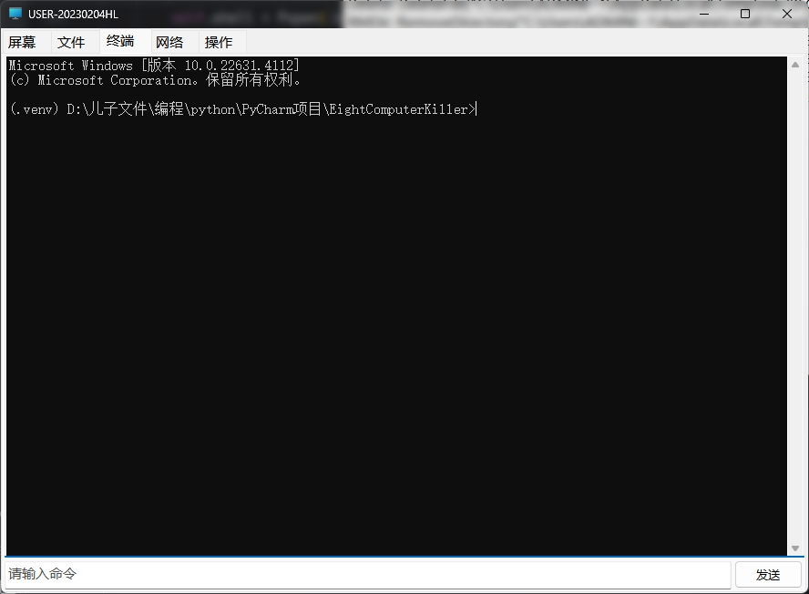
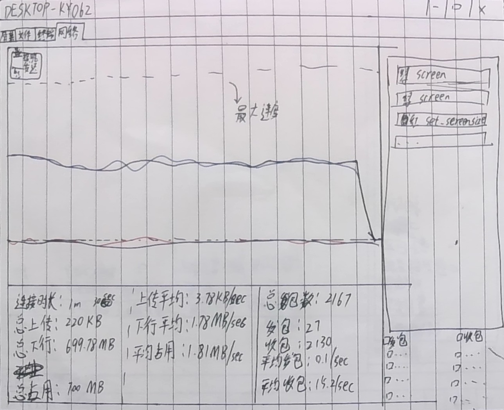
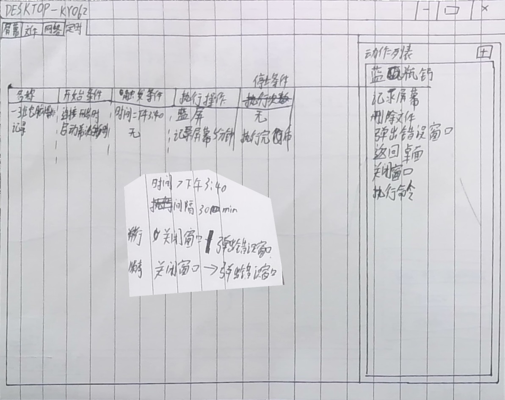
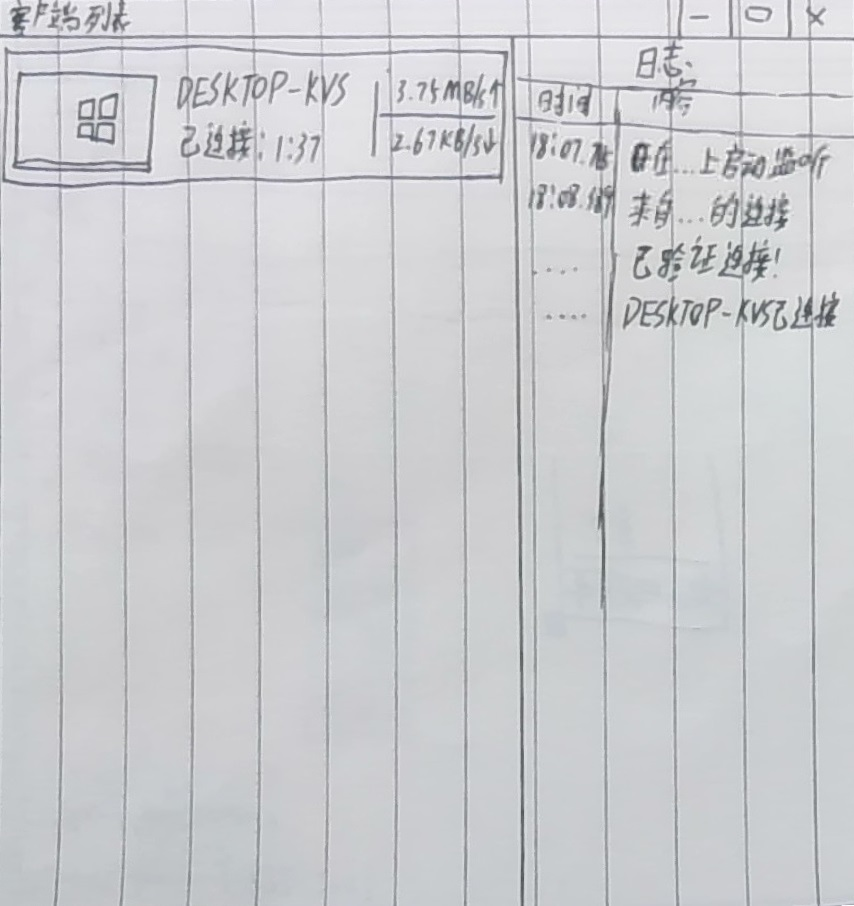

# _ClassOneComputerKiller_
### __一个隐藏式远程控制软件，仅供学习使用__
### __严禁用于非法用途！！！__

## 概述
项目创建于2024.9.2，至2024.9.16均为本人开发\
项目名含义为 "一班电脑杀手", 专为Seewo课堂教学机设计\
GUI使用[wxPython](https://github.com/wxWidgets/Phoenix)实现, 这是我第一次使用这个库, 有写得不好的请见谅

## 如何运行
1. 下载项目 `git clone https://github.com/hite4044/ClassOneComputerKiller.git`
2. 安装依赖 `pip install -r requirements.txt`
3. 修改`client.py`里的`DEFAULT_PORT`和`DEFAULT_HOST` (你可能需要使用Frp服务)
4. 打包好`client.py` `pyinstaller -w -F client.py`
5. 并放置打包程序到被控端电脑 (需自行设置开机自启动)
6. 运行main.py等待连接

## 目前实现的功能
- 屏幕监视
- 文件浏览 + 文件查看
- 终端

## 将来想要实现的功能
- 定时执行操作
- 未连接时仍可设定
- 客户端列表
- 文件传输
- 网络交通显示

## 软件设计稿
 因为我的相机是广角相机，所以可能我处理得不是很好

### 屏幕Tab

### 文件Tab

### 终端Tab

### 客户端列表Tab

### 动作Tab

### 客户端列表窗口
